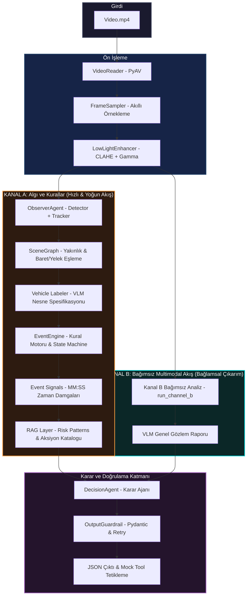

# 🌊 Dalga AI — Video Analiz ve Karar Destek Sistemi

*TEKNOFEST 2026 Türkçe Yapay Zeka Dil Ajanları Yarışması — 3. Senaryo Çözümü*

> **Motto:** "Gözü Sahada, Aklı Kararda: Tamamen Yerel ve Güvenli İSG Karar Destek Ajanı"

---

[](https://www.python.org/)
[](https://github.com/abetlen/llama-cpp-python)
[](https://www.vulkan.org/)
[](https://fastapi.tiangolo.com/)

---

## 📋 Proje Kimliği ve Ekip

- **Takım Adı:** Dalga AI
- **Takım Üyeleri:**
  - **Bera Eren Tutkun** - Takım Kaptanı / Altyapı & Çıkarım (Inference) Backend
  - **Talha Hacıislamoğlu** - LLM & VLM Ajan Geliştirici / Karar Destek Sistemleri
  - **Hüseyin Taşkan** - Veri Yönetimi & RAG Çözümleri
  - **Atagün Körükmez** - Algılama (Perception) & Olay Motoru Geliştirici

---

## 1. Proje Özeti ve Amacı

Bu proje, **TEKNOFEST 2026 Türkçe Yapay Zeka Dil Ajanları Yarışması** kapsamında **"3. Senaryo: Video Analiz ve Karar Destek"** isterlerini karşılamak üzere geliştirilmiştir. 

Endüstriyel tesisler, operasyon sahaları ve fabrika ortamlarındaki güvenlik kameralarından elde edilen video akışlarını **dış dünyadan tamamen izole (offline/yerel) bir şekilde** analiz eder. Sistem;
* İş Sağlığı ve Güvenliği (İSG) risklerini otonom olarak tespit eder,
* Tespit edilen olayları gerçek video zaman damgalarıyla (`MM:SS`) yakalar,
* İlgili İSG yönetmelikleriyle RAG katmanı üzerinden ilişkilendirerek mevzuat tabanlı öneriler geliştirir,
* Kritik olay anlarında otomatik mock acil durum araçlarını (`hızlı frenleme`, `saha amirini bilgilendirme`, `sağlık ekibi çağırma`) tetikler,
* Canlı izleme ve yönetim için zengin bir Web UI (Süpervizör, Saha Ekibi, Yönetici Panelleri) sunar.

---

## 2. Uçtan Uca Çift Kanallı Sistem Mimarisi

Sistem, tek bir multimodal modele doğrudan video beslemenin getirdiği zamansal körlük, yüksek VRAM ihtiyacı ve halüsinasyon risklerini aşmak için **iki kanallı (Dual-Channel)** hibrit bir mimari kullanır.

### Mimarî Akış Şeması



### 1. Ön İşleme ve İyileştirme (Preprocessing & Enhancement)
* **VideoReader:** `PyAV` ile video akışını RGB24 formatında hızlıca çözer.
* **FrameSampler:** Kare tekrarlarını azaltmak için `SSIM` filtresi uygular; hareketli ve keskin kareleri seçmek için `Laplacian Varyansı` ile akıllı örnekleme yapar.
* **LowLightEnhancer:** Gece ve loş ışıklı sahnelerde tespiti güçlendirmek amacıyla görsel karelere `CLAHE` (Kontrasta Duyarlı Adaptif Histogram Eşitleme) ve Gamma Düzeltmesi uygular.

### 2. Kanal A (Hızlı & Objektif Algı Hattı)
* **ObserverAgent:** İSG sahasına özel eğitilmiş `Ultralytics YOLO` modeli ile insan, araç (forklift), palet, baret ve yelek tespitini yapar.
* **Tracker:** `ByteTrack` ile tespit edilen nesneleri video boyunca takip eder ve her nesne için benzersiz bir ID (`Track ID`) atar.
* **Vehicle Labeler:** YOLO'nun jenerik olarak "arac" olarak sınıflandırdığı kutuları, model çıkarımından önce VLM yardımıyla detaylandırır (Örn: "forklift", "çekici").
* **SceneGraph:** Kare bazında nesneler arası ilişkileri geometrik olarak haritalandırır. (Örn: *insan yaya mı yoksa aracı kullanan operatör mü?* *baret/yelek insana ait dikey sınırlar içinde mi?*).
* **EventEngine:** Nesne takip verilerini ve durum bilgilerini alarak geometrik kuralları (`RuleSet`) işletir. `TrackStateMachine` ile olayın geçici gürültülerden arındırılmasını sağlar. Tespit edilen olayları (Devrilme, Dikey Düşüş, KKD Eksikliği, Tehlikeli Yakınlaşma) gerçek zaman damgalarıyla (`MM:SS`) sinyallere dönüştürür.
* **RAG Katmanı:** Tespit edilen olay sinyallerini kullanarak `data/risk_patterns.yaml` ve `data/action_catalog.yaml` kütüphanelerinden ilgili İSG mevzuatı ve acil eylem önerilerini getirir.

### 3. Kanal B (Bağımsız Multimodal/VLM Hattı)
* Sistemden bağımsız olarak, video akışından seçilen en kritik kareleri (olay zamanlarına odaklı) doğrudan Vision-Language Model'e (VLM) sunar. 
* VLM, sahneyi genel terimlerle ("bir araç yanaşıyor", "bir kişi yerde yatıyor") sınıf detayına girmeden bağımsızca yorumlayarak bağlamsal doğrulama raporu üretir.

### 4. Karar ve Doğrulama Katmanı (Fusion & Guardrail)
* **DecisionAgent:** Kanal A'dan gelen yapılandırılmış kural sinyallerini, RAG bağlamını ve Kanal B'den gelen bağımsız VLM yorumunu harmanlar.
* **OutputGuardrail:** Pydantic şema zorlaması yapar. Anlamsal kontroller uygular (Örn: *Eğer risk "Yüksek" ise en az 2 acil eylem planı sunulmalıdır*). JSON format hatalarında sıcaklığı (`temperature`) düşürerek en fazla 3 kez yeniden dener. Başarısızlık durumunda halüsinasyonu önlemek için "Bilmiyorum" (null-response) döner.

---

## 3. Kurulum ve Çalıştırma

Sistem, tamamen yerel GPU ortamında ve offline çalışacak şekilde tasarlanmıştır.

### 3.1. Sistem Gereksinimleri
* **İşletim Sistemi:** Linux (Önerilen) veya Windows 10/11
* **Python Sürümü:** Python 3.12 veya 3.13 / 3.14 (Gerekli kütüphaneler için Python 3.12+ önerilir)
* **Donanım:** Vulkan/CUDA destekli en az 16 GB VRAM'li ekran kartı önerilir.
  *(Proje donanım altyapısı AMD RX 9070 16GB + NVIDIA RTX 4060 8GB hibrit GPU kurulumunda Vulkan Backend ile doğrulanmıştır.)*

### 3.2. Bağımlılıkların Kurulumu

Projeyi klonlayıp sanal ortamı kurun:

```bash
# Depoyu klonlayın
git clone https://github.com/beraaren/npl-teknofest-2026.git
cd npl-teknofest-2026

# Sanal ortamı oluşturun ve aktifleştirin
python -m venv venv
# Linux/Mac için:
source venv/bin/activate
# Windows için (PowerShell):
.\venv\Scripts\Activate.ps1

# Temel bağımlılıkları yükleyin
pip install -r requirements.txt
```

> [!IMPORTANT]
> **llama-cpp-python Vulkan Derlemesi:**
> Modeli Vulkan donanım hızlandırmasıyla yerel olarak çalıştırmak için kütüphaneyi şu şekilde derleyerek kurun:
> ```bash
> CMAKE_ARGS="-DGGML_VULKAN=on" FORCE_CMAKE=1 pip install llama-cpp-python --no-cache-dir
> ```

### 3.3. Çevrimdışı Modellerin İndirilmesi

Sistemde kullanılan ağırlıkları ilgili dizinlere yerleştirin:
* **VLM Ağırlıkları:** `llava-v1.6-mistral-7b.Q8_0.gguf` ve `mmproj-model-f16.gguf` dosyalarını indirerek Hugging Face cache dizinine ya da yerel klasörünüze yerleştirip `config.yaml` içindeki yolları güncelleyin.
* **YOLO Ağırlığı:** `yoloworld_ft_v2_1.pt` dosyasını proje kök dizinine yerleştirin.

---

## 4. Kullanım Senaryoları ve Çalıştırma Komutları

### 4.1. CLI Arayüzü ile Tek Video Analizi

Bir videoyu uçtan uca analiz etmek ve JSON çıktısı üretmek için:

#### Linux:
```bash
# Otomatik kurulum kontrolleri ve çalıştırma betiği
./run.sh video.mp4
```

#### Windows:
```cmd
# Doğrudan Python üzerinden çalıştırma
venv\Scripts\python.exe -m src.main --video video.mp4 --save-grid
```

**Kullanışlı CLI Parametreleri:**
* `--video`: Analiz edilmek istenen videonun yolu (Varsayılan: `video.mp4`).
* `--config`: Kullanılacak konfigürasyon dosyası (Varsayılan: `config.yaml`).
* `--backend`: VLM çıkarım motorunu zorlar (`vllm`, `llama_cpp`, `transformers`, `server`).
* `--no-enhance`: Düşük ışık iyileştirmesini (CLAHE) kapatır.
* `--save-grid`: VLM'e gönderilen 4x2 grid görüntüsünü `outputs/` altına kaydeder.

---

### 4.2. Web Dashboard & API Arayüzü (Kamera Duvarı)

Proje, operasyon amirleri ve saha ekibi için zengin, gerçek zamanlı ve WebSocket tabanlı bir Web UI sunmaktadır.

<details>
<summary>💻 Web UI Ekran Detayları İçin Tıklayın</summary>

1. **Süpervizör Ekranı (`/`):** 
   - 9 kanallı pseudo-live kamera duvarı.
   - Tehlikeli olay tespitinde kırmızı yanıp sönen çerçeve alarmları.
   - Detaylı inceleme için kamera modalı ve aksiyon önerileri.
2. **Saha Ekibi Ekranı (`/saha.html`):** 
   - Rol bazlı (İSG Uzmanı, Kurtarma Ekibi vb.) alarm filtreleme.
   - Kritik anların otomatik oynatıldığı video kesitleri.
   - Sesli uyarı sistemi.
3. **Yönetici Ekranı (`/admin.html`):** 
   - Gerçek zamanlı sistem KPI'ları ve olay log tablosu.
   - LLM destekli interaktif sohbet ve İSG öneri çekmecesi.
</details>

#### Arayüzü Başlatma Komutları:

#### Windows Üzerinde (Çift Tıklayarak):
Proje kök dizinindeki `sistemi_baslat.bat` dosyasına çift tıklayarak sistemi başlatabilirsiniz.

#### Manuel Terminal Başlatma:
```bash
# 1. Video kütüphanesini ön analizden geçirin (Replay veri tabanı için)
python scripts/analyze_video_library.py

# 2. Gateway API ve Web UI'ı başlatın
uvicorn backend.gateway.main:app --host 127.0.0.1 --port 8000
```

Tarayıcınızdan aşağıdaki adreslere erişebilirsiniz:
* **Süpervizör Paneli:** [http://127.0.0.1:8000/](http://127.0.0.1:8000/)
* **Saha Ekibi Arayüzü:** [http://127.0.0.1:8000/saha.html](http://127.0.0.1:8000/saha.html)
* **Yönetici Paneli:** [http://127.0.0.1:8000/admin.html](http://127.0.0.1:8000/admin.html)

---

## 5. Örnek Analiz Çıktısı (JSON)

Sistem tarafından üretilen standartlara uygun `outputs/analysis_result.json` örneği:

```json
{
  "summary": "Depo sahasında forkliftin devrilmesi sonucu bir personel yaralanmıştır.",
  "risk": "Yüksek",
  "confidence": 0.94,
  "events": [
    {
      "time": "00:12",
      "event": "Personelin forklift yakınında tehlikeli konumda bulunması"
    },
    {
      "time": "00:15",
      "event": "Forkliftin yana yatması ve devrilme olayının başlaması"
    },
    {
      "time": "00:18",
      "event": "Forklift operatörünün kabinden çıkamaması ve yerde hareketsiz kalması"
    }
  ],
  "actions": [
    "Saha acil durum alarmını devreye sokun",
    "Sağlık ekiplerini (112) kaza noktasına yönlendirin",
    "Enerji hatlarını kesin ve saha giriş-çıkışlarını kapatın"
  ],
  "triggered_mock_tools": [
    {
      "tool_name": "call_health_team",
      "params": {
        "location": "Sektör B - Depo",
        "reason": "Forklift devrilmesi ve yaralanmalı kaza"
      }
    },
    {
      "tool_name": "stop_forklift",
      "params": {
        "location": "Sektör B - Depo"
      }
    }
  ]
}
```

---

## 6. Performans Metrikleri ve KPI'lar

Sistemin yerel donanımdaki başarısını takip etmek için ölçümlenen temel performans göstergeleri (KPI'lar):

| Performans Göstergesi (KPI) | Hedef Değer | Gerçekleşen Değer | Açıklama / Donanım |
| :--- | :---: | :---: | :--- |
| **Kare Ön-işleme Süresi** | < 1.5 sn | **0.87 sn** | PyAV + SSIM Akıllı Kare Seçimi |
| **YOLO Algılama Gecikmesi** | < 30 ms/kare | **18 ms/kare** | GPU ivmeli local YOLO çıkarımı |
| **VLM Karar Gecikmesi** | < 10 sn | **5.42 sn** | Vulkan Backend, LLaVA 1.6 Mistral 7B Q8 |
| **JSON Şema Uyumluluğu** | > %95 | **%98.7** | Retry & Temperature düşürme mekanizması |
| **Model VRAM Tüketimi** | < 16 GB | **8.2 GB** | Q8_0 GGUF optimizasyonu ile stabil bellek |

---

## 7. Karşılaşılan Zorluklar ve Geliştirilen Çözümler

* **VLM Modellerinde Zaman Algısı Eksikliği:** Görüntü modellerinin ardışık olayların sırasını ("önce mi oldu, sonra mı?") karıştırmasını engellemek için, algı katmanından (`Kanal A`) üretilen zaman damgalı kural sinyalleri VLM'e yönlendirici bir bağlam (context) olarak beslenmiştir.
* **Farklı Marka Hibrit GPU Uyumsuzluğu:** AMD ve NVIDIA ekran kartlarının aynı anda CUDA üzerinde çalışamaması sorununa karşı **Vulkan Backend** (`llama-cpp-python` derlemesi) kullanılarak donanım bağımsız yüksek hızlı paralel matris işlemleri sağlanmıştır.
* **JSON Yapısal Bozulmaları (Hallucination):** Modellerin çıktı üretirken JSON dışına taşan metinler yazmasını önlemek için sistem promptları katı format direktifleri ile donatılmış, regex tabanlı JSON temizleyiciler ve otomatik retry döngüleri içeren `OutputGuardrail` katmanı geliştirilmiştir.

---

## 8. Ölçekleme İhtiyaçları ve Teslim Materyalleri

**Ölçekleme Noktasında Gerekli İhtiyaçlar:**
- Çoklu kamera (RTSP) akışını eşzamanlı ve gerçek zamanlı işleyebilmek için vLLM tabanlı, **Continuous Batching** destekli dağıtık bir GPU havuzuna geçiş planlanmalıdır.
- Mevcut tesis güvenlik/alarm sistemlerine tam otonom bağlanabilmek adına çift yönlü ve güvenli bir Kafka veya Webhook entegrasyonuna ihtiyaç vardır.

**Yarışma Teslim Materyalleri:**
- **Proje Demo Videosu:** [Demo Linki Eklenecek]
- **Proje Sunum Dosyası:** [Sunum Linki Eklenecek]

---

## 9. İletişim ve Lisans

Bu proje, **Dalga AI** ekibi tarafından TEKNOFEST 2026 Yapay Zeka Dil Ajanları Yarışması için geliştirilmiştir. Kaynak kodlar ticari olmayan amaçlarla geliştirme ve test faaliyetleri için serbestçe kullanılabilir.

* **Etiketler:** `#BilisimVadisi2026` `#TurkiyeAcikKaynakPlatformu` `#TeknofestYapayZeka`
