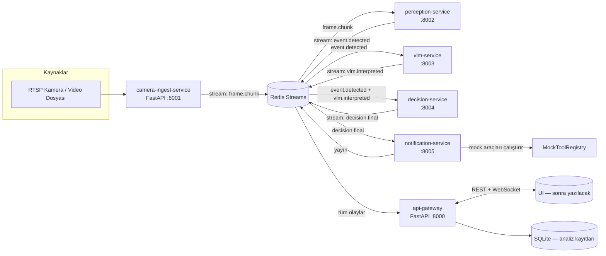

# Backend Tasarımı — Dalga AI Video Analiz ve Karar Destek Sistemi

_TEKNOFEST 2026 Türkçe Yapay Zeka Dil Ajanları Yarışması — Senaryo 3_
_Hedef: UI'dan önce API-first bir backend; UI, bu backend'in sözleşmeleri üzerine inşa edilecek._

---

## 1. Geliştirme Notları (Mimari İlkeler)

Bu bölüm kod yazılmadan önce bağlayıcıdır. Tasarımın geri kalanı bu ilkelere göre şekillendi.

### 1.1 Gereksiz soyutlamadan kaçınma

- **Mevcut `src/` pipeline'ı sarılır, yeniden yazılmaz.** `ObserverAgent`, `EventEngine`,
  `RAGLayer`, `DecisionAgent`, `OutputGuardrail`, `MockToolRegistry` zaten test edilmiş
  (`tests/` altında 8 test dosyası) ve çalışan modüllerdir. Backend bunları **olduğu gibi
  import eder**; etrafına yeni strateji/factory katmanları örülmez.
- Yeni arayüz (interface/ABC) **yalnızca gerçekten iki implementasyon varsa** açılır.
  "İleride lazım olur" diye soyutlama eklenmez.
- Her servis düz bir `main()` + ince bir FastAPI katmanıdır. Servis içi katman sayısı:
  `endpoint → mevcut src modülü → mesaj yayınla`. Arada servis-locator, repository,
  unit-of-work gibi desenler **yoktur**.
- Bağımlılık eklerken kural: şartname "yerel ve ücretsiz" diyor; her yeni bağımlılık
  `requirements.txt`'e girmeden önce "stdlib/Redis/FastAPI ile çözülür mü?" sorusu sorulur.

### 1.2 Mimari borç oluşturmama

- **Tek config kaynağı:** `config.yaml` tüm servislerce paylaşılır; servis başına ayrı
  config formatı icat edilmez. Servisler sadece kendi bölümünü okur
  (`preprocessing`, `perception`, `vlm`, `decision_agent`, `output` zaten ayrık).
- **Tek sözleşme paketi:** Servisler arası mesaj şemaları `backend/contracts/` altında
  Pydantic modelleri olarak yaşar. Şema değişikliği tek yerden yapılır; dict ile
  "gevşek" mesaj geçmek yasaktır (guardrail'in şema disiplini mesajlaşmaya da uygulanır).
- **Geriye dönük uyum:** CLI akışı (`src/main.py`, `test_akis.py`) bozulmaz. Backend,
  CLI'ın yanında duran ikinci bir çalıştırma yoludur; CLI'ı kıracak refactor yapılmaz.

### 1.3 FastAPI ve API-first yaklaşım

- Tüm dış dünya iletişimi **FastAPI** üzerinden: REST (OpenAPI otomatik dokümanı
  `/docs`'ta) + WebSocket (canlı bildirim). Başka HTTP framework'ü yok.
- **UI tasarlanmadan önce sözleşme donar:** UI geliştirmesi, `openapi.json` ve WebSocket
  mesaj şemalarına göre yapılacak. Backend, UI'ın ihtiyacına göre endpoint eğip bükmez;
  UI, backend'in verdiği sözleşmeyi tüketir.
- Her endpoint'in yanıtı Pydantic response modelidir; elle dict dönülmez.

### 1.4 Mikroservis sadakati (ama abartmadan)

- Servis sınırları, pipeline'ın **doğal veri sınırlarıdır**: görüntü giren yer,
  algı üreten yer, karar üreten yer, bildirim çıkan yer. Daha ince bölmek
  (örn. "resize-service") gereksiz ağ maliyeti ve borç üretir — yapılmaz.
- Her servis **bağımsız süreç** olarak çalışır, kendi `/health` ve `/metrics`'ini sunar,
  tek başına çöküp kalkabilir. Ama hepsi aynı repoda ve aynı Python ortamında yaşar
  (monorepo); servis başına ayrı repo/requirements yaratılmaz.
- GPU kullanan tek servis **vlm-service**'tir; diğerleri CPU'da çalışır. Ölçekleme
  gerektiğinde yalnızca vlm-service yatay büyütülür.

### 1.5 Asenkron iletişim

- Servisler arası iletişim **senkron HTTP çağrı zinciri değil**, Redis Streams üzerinden
  **olay güdümlü (event-driven)** mesajlaşmadır. Bir servis diğerini "çağırmaz";
  olayı yayınlar, ilgilenen tüketir. Böylece:
  - VLM'in yavaş olması algıyı bloklamaz,
  - Bildirim servisi çökerse analiz yine tamamlanır,
  - UI'a canlı akış aynı olay kanalından bedava gelir.
- Tüm servis kodu `asyncio` + `redis.asyncio` ile yazılır; kare işleme gibi CPU-yoğun
  işler `run_in_executor` ile bloklamadan yürütülür.
- **Büyük veri mesajdan geçmez:** Kareler/görüntüler paylaşılan disk hacminde durur
  (`data/`); mesajlar yalnızca **yol + metaveri** taşır (referansla geçiş).

### 1.6 Yarışma kısıtları

- Tamamen **offline**: Redis, FastAPI, mevcut modeller — hepsi yerel. Dış API çağrısı yok.
- Mock araçlar (`MockToolRegistry`) şartnamenin istediği "mock fonksiyon" yükümlülüğünü
  karşılar; notification-service bunları **gerçekten çalıştırır** (log + WebSocket izi),
  sadece öneri olarak bırakmaz.
- Yapılandırılmış JSON çıktı şartnamedeki şemaya sadık kalır
  (`summary`, `events[]`, `risk`, `actions[]`) ve Guardrail'den geçer.

---

## 2. Detaylı Tasarım

### 2.1 Kullanım Senaryosu (yarışma demosu)

> Bir saha güvenlik kamerası görüntü üretir → sistem analiz eder → operatöre bildirim düşer.

1. Operatör UI'dan (veya demo sırasında `curl`/script ile) bir kamera tanımlar:
   `POST /cameras` — kaynak olarak RTSP URL'si, canlı yakalama cihazı **veya** demo için
   bir video dosyası (`INDIR_BENCHMARK/videos/Arson/xxx.mp4` gibi).
2. Kamera aktifken ingest servisi kareleri Kanal A yoğunluğunda (`channel_a_fps: 24`)
   okur, `data/frames/<job_id>/` altına yazar ve `frame.chunk` olayları yayınlar.
3. Algı servisi kareleri tüketir: YOLO + ByteTrack → sahne grafi → `EventEngine`
   geometrik kuralları (devrilme, düşme, toplanma, hareketsizlik, KKD eksikliği,
   tehlikeli yakınlık) → `event.detected` olayları.
4. Kritik olay görüldüğünde VLM servisi Kanal B'yi çalıştırır: kritik karelerden grid
   oluşturup mevcut llama.cpp/vLLM sunucusuna sorar → bağımsız görsel yorum.
5. Karar servisi üç kanıtı birleştirir (geometrik sinyaller + RAG risk kataloğu +
   VLM yorumu), `DecisionAgent` + `OutputGuardrail` ile şartname şemasında nihai
   JSON üretir → `decision.final` olayı.
6. Bildirim servisi risk seviyesine göre mock araçları **çalıştırır**
   (`call_medical_team`, `secure_area`, `save_footage` …) ve sonucu WebSocket'ten
   bağlı tüm UI istemcilerine anlık iter. Operatör ekranında:
   _"00:15 Forklift devrildi — Risk: Yüksek — Sağlık ekibi çağrıldı"_ belirir.
7. Operatör `GET /analyses/{id}` ile tam raporu (özet, zaman damgalı olaylar, risk,
   aksiyonlar, reasoning) sorgular.

Tek seferlik dosya analizi de aynı boru hattından geçer: `POST /analyses` ile video
dosyası yüklenir, sistem onu "tek seferlik kamera" gibi işler. Böylece iki ayrı kod
yolu (batch vs. stream) bakımı yapılmaz.

### 2.2 Servis Haritası



- **Redis Streams** tek altyapı bağımlılığıdır (broker + hafif cache). Mesaj kalıcılığı
  ve consumer-group desteği verir; RabbitMQ/Kafka gibi ağır alternatiflere gerek yok.
- **api-gateway** aynı zamanda bir Redis tüketicisidir: olay akışını dinleyip hem
  WebSocket istemcilerine iter hem de `decision.final`'ı SQLite'a yazar.

### 2.3 Servisler

#### 2.3.1 camera-ingest-service (`:8001`)

- **Görev:** Kamera/video kaynağını okuyup kare akışını sisteme sokmak.
  `test_akis.py` AŞAMA 1'in servisleşmiş hali.
- **Kullandığı mevcut kod:** `VideoReader`, Kanal A örnekleme mantığı
  (`native_fps / channel_a_fps` adımı).
- **Davranış:**
  - Her kaynak bir `job`'dır; kareler `data/frames/<job_id>/f_000123.jpg` olarak diske
    yazılır, `frame.chunk` mesajına yol + gerçek video indeksi + fps konur.
  - Dosya modunda video bitince `stream.eof` yayınlar; RTSP modunda sonsuz akış,
    pencere bazlı (`window_seconds`, varsayılan 30 sn) analiz tetiklenir.
- **Uçlar:** `GET /health`, dahili `POST /jobs` (gateway'den çağrılır).

#### 2.3.2 perception-service (`:8002`)

- **Görev:** Karelerden sahne grafi ve olay sinyali üretmek.
  AŞAMA 2–4'ün servisleşmiş hali.
- **Kullandığı mevcut kod:** `ObserverAgent` (YOLO + ByteTrack), `EventEngine`
  (8 geometrik kural), `FrameSampler`, `LowLightEnhancer`.
- **Davranış:** `frame.chunk`'ları job bazında tamponlar; Kanal A penceresi kapanınca
  gözlemleri çıkarır, `EventEngine`'e besler, her sinyal için `event.detected` yayınlar.
  Sinyal formatı mevcut `EventEngine.get_signals()` çıktısıyla birebir aynıdır
  (`event_type`, `timestamp`, `confidence`, `description`).
- **Uçlar:** `GET /health`, `GET /metrics` (kare/sn, tespit sayısı).

#### 2.3.3 vlm-service (`:8003`)

- **Görev:** Bağımsız görsel yorum (Kanal B). AŞAMA 7'nin servisleşmiş hali.
- **Kullandığı mevcut kod:** `Kanal_B/pipeline.py:run_channel_b` öncelikli; çalışmazsa
  `DecisionAgent.interpret_frames` fallback'i (mevcut davranışın aynısı). VLM çağrısı
  mevcut OpenAI-uyumlu sunucuya gider (`config.vlm.server.base_url`, `llama-server`
  veya `vllm serve` — değişmez).
- **Davranış:** Kritik olay sinyali geldiğinde tetiklenir; `select_critical_frames`
  ile kritik kareleri seçer, grid oluşturur, VLM'e sorar, `vlm.interpreted` yayınlar.
  **Kanal B bağımsızlığı korunur:** bu servise olay sinyali dışında kanıt (RAG, sahne
  grafi) verilmez — birleştirme yalnızca decision-service'te olur.
- **GPU:** Tek GPU tüketicisi. Yoğunlukta yatay çoğaltılabilir (consumer group).

#### 2.3.4 decision-service (`:8004`)

- **Görev:** Kanıtları birleştirip nihai kararı üretmek. AŞAMA 5–9'un servisleşmiş hali.
- **Kullandığı mevcut kod:** `RAGLayer`, `ShortTermMemory`, `DecisionAgent`,
  `OutputGuardrail`.
- **Davranış:** Job'un `event.detected` + `vlm.interpreted` mesajlarını birleştirir;
  RAG bağlamını kurar, karar prompt'unu oluşturur, VLM'den karar alır, Guardrail
  (şema doğrulama + kademeli retry, `temperatures: [0.15, 0.10, 0.05]`) ile nihai JSON'u
  üretir ve `decision.final` yayınlar. Çıktı şeması şartname + `config.output.output_schema`
  ile birebir aynıdır.
- **Model bağımsızlığı:** Karar promptu ve Guardrail konuşması da mevcut
  `config.vlm.server` üzerinden yapılır; ayrı LLM altyapısı eklenmez.

#### 2.3.5 notification-service (`:8005`)

- **Görev:** Kararları eyleme dönüştürmek ve dış dünyaya duyurmak.
  AŞAMA 10'un servisleşmiş hali.
- **Kullandığı mevcut kod:** `MockToolRegistry` (`suggest_tools` + `execute`).
- **Davranış:** `decision.final` geldiğinde:
  1. Model araç seçtiyse onları, seçmediyse kural tabanlı öneriyi çalıştırır
     (mevcut `main.py` davranışının aynısı).
  2. Her araç sonucunu `tool.executed` olayı olarak yayınlar.
  3. `notification.push` olayı yayınlar: operatöre gidecek kısa Türkçe bildirim
     (`risk`, `summary`, ilk aksiyon).
- Şartnamedeki "mock fonksiyonların ajanın araçları olarak kullanılması" kriteri
  burada görünür ve izlenebilir olur.

#### 2.3.6 api-gateway (`:8000`)

- **Görev:** Dış dünyanın (UI, jüri demosu, scriptler) tek giriş noktası.
- İki işi vardır:
  - **REST:** kamera ve analiz yönetimi (aşağıda §2.5).
  - **Olay köprüsü:** Redis akışlarını dinler; `decision.final`'ı SQLite'a kalıcı yazar,
    tüm olayları WebSocket `/ws` üzerinden bağlı istemcilere iter.
- İş mantığı **içermez**; sadece yönlendirme + kalıcılık + canlı yayın. Bu sayede
  UI'a "backend'e göre tasarlanacak" temiz bir yüzey kalır.

### 2.4 Mesaj Sözleşmeleri (`backend/contracts/`)

Tümü Pydantic v2 modeli; Redis Streams'e `model_dump_json()` ile yazılır, tüketen
`model_validate_json` ile okur. Bilinmeyen alan eklemek serbest, mevcut alanı
yeniden adlandırmak yasak.

```python
class FrameChunk(BaseModel):        # stream: frame.chunk
    job_id: str
    camera_id: str
    frame_paths: list[str]          # data/frames/<job_id>/...
    frame_indices: list[int]        # gerçek video indeksleri
    fps: float
    is_last: bool = False

class EventDetected(BaseModel):     # stream: event.detected  (EventEngine çıktısıyla aynı)
    job_id: str
    camera_id: str
    event_type: str                 # tip_over | fall | gathering | immobility | ...
    timestamp: str                  # "MM:SS"
    confidence: float
    description: str

class VlmInterpreted(BaseModel):    # stream: vlm.interpreted
    job_id: str
    camera_id: str
    interpretation: dict            # run_channel_b / interpret_frames çıktısı
    critical_indices: list[int]

class DecisionFinal(BaseModel):     # stream: decision.final  (şartname JSON şeması)
    job_id: str
    camera_id: str
    summary: str
    events: list[dict]              # time, event, event_type, confidence
    risk: Literal["Düşük", "Orta", "Yüksek"]
    actions: list[str]
    reasoning: str
    confidence: float
    triggered_mock_tools: list[dict]

class ToolExecuted(BaseModel):      # stream: tool.executed
    job_id: str
    tool_name: str
    params: dict
    status: str                     # MockToolRegistry.execute sonucu
    mock_result: str

class NotificationPush(BaseModel):  # stream: notification.push → WebSocket'e aynen geçer
    job_id: str
    camera_id: str
    risk: str
    headline: str                   # "00:15 Forklift devrildi"
    summary: str
    actions: list[str]
    created_at: datetime
```

### 2.5 API Sözleşmesi (api-gateway — UI bunun üstüne kurulacak)

REST (önek `/api/v1`):

| Metot | Yol | Açıklama |
|---|---|---|
| `POST` | `/cameras` | Kamera tanımla (`name`, `source`: rtsp url veya `file://` yolu) |
| `GET` | `/cameras` | Kamera listesi + durum (aktif/ölçümleniyor/hata) |
| `DELETE` | `/cameras/{id}` | Kamerayı durdur ve sil |
| `POST` | `/analyses` | Tek seferlik dosya analizi başlat (`video_path`) → `job_id` döner |
| `GET` | `/analyses` | Analiz listesi (sayfalı, `camera_id`/`risk` filtreli) |
| `GET` | `/analyses/{job_id}` | Nihai JSON raporu (şartname şeması + metadata) |
| `GET` | `/analyses/{job_id}/events` | Job'a ait olay akışı (debug/demo için) |
| `GET` | `/health` | Gateway + downstream servis sağlık özeti |
| `GET` | `/metrics` | KPI'lar: işlem süresi, olay sayısı, risk dağılımı |

WebSocket:

- `WS /ws` — bağlanan her istemci tüm `event.detected`, `decision.final`,
  `tool.executed`, `notification.push` mesajlarını JSON olarak anlık alır.
  İsteğe bağlı `?camera_id=` filtresi. UI'ın canlı bildirim ihtiyacının tamamı budur.

### 2.6 `test_akis.py` Aşama Eşlemesi

| test_akis.py aşaması | Servis | Stream |
|---|---|---|
| 1 — Video okuma (Kanal A) | camera-ingest | `frame.chunk` |
| 2 — Kanal B örnekleme + ön işleme | perception (ve vlm girişi) | — |
| 3 — Gözlemci Ajan (YOLO + tracker) | perception | — |
| 4 — Olay Tespit Motoru | perception | `event.detected` |
| 5 — RAG Katmanı | decision | — |
| 6 — Hafıza + araç kataloğu | decision | — |
| 7 — Kanal B VLM yorumu | vlm | `vlm.interpreted` |
| 8 — Karar Ajanı | decision | — |
| 9 — Guardrail | decision | `decision.final` |
| 10 — Araç çalıştırma | notification | `tool.executed`, `notification.push` |

Bu tablo aynı zamanda demo senaryosudur: `test_akis.py` konsolda gösterdiği 10 adımı,
backend WebSocket akışında **canlı** gösterir — jüri demosu için hazır anlatı.

### 2.7 Dizin Yapısı

```
bera/
├── src/                     # MEVCUT — dokunulmuyor, servisler buradan import eder
├── Kanal_B/                 # MEVCUT — vlm-service kullanır
├── backend/
│   ├── contracts/           # §2.4'teki Pydantic modelleri (tek sözleşme kaynağı)
│   │   └── messages.py
│   ├── common/
│   │   ├── redis.py         # ince yayınla/tüket yardımcıları (redis.asyncio)
│   │   └── health.py        # ortak /health endpoint fabrikası
│   ├── gateway/
│   │   ├── main.py          # FastAPI app: REST + WebSocket + Redis→SQLite köprüsü
│   │   ├── routers/         # cameras.py, analyses.py
│   │   └── store.py         # SQLite erişimi (stdlib sqlite3, ORM yok)
│   ├── ingest/
│   │   └── main.py          # camera-ingest-service
│   ├── perception/
│   │   └── main.py          # perception-service
│   ├── vlm/
│   │   └── main.py          # vlm-service
│   ├── decision/
│   │   └── main.py          # decision-service
│   ├── notification/
│   │   └── main.py          # notification-service
│   └── docker-compose.yml   # redis + 6 servis
├── config.yaml              # MEVCUT — tüm servislerin ortak config'i
└── data/frames/             # paylaşılan kare hacmi (compose'da volume)
```

Her servis `main.py`'si aynı iskeleti izler: config yükle → Redis'e bağlan →
consumer loop → FastAPI `/health`/`metrics` (uvicorn, ayrı port).

### 2.8 Çalıştırma

```bash
# Altyapı + tüm servisler
cd backend && docker compose up --build

# VLM sunucusu (mevcut betik, değişmez)
./start_vlm_server.sh --bg

# Demo: dosya analizi
curl -X POST localhost:8000/api/v1/analyses -d '{"video_path": "video.mp4"}'

# Demo: canlı bildirimleri izle (UI yerine geçici istemci)
websocat ws://localhost:8000/ws
```

Yerel geliştirmede Docker zorunlu değil: `redis-server` + her servis
`python -m backend.<servis>.main` ile ayrı terminalde çalışır.

### 2.9 Hata Yönetimi ve Dayanıklılık

- **VLM çökerse:** vlm-service mesajı ACK'lemez → Redis pending'de kalır, servis dönünce
  devam eder. decision-service VLM yorumu olmadan da (yalnız geometrik + RAG kanıtıyla)
  karar verebilir; `reasoning` alanında "tek kaynak" notu düşer — mevcut prompt zaten
  bunu öğretiyor.
- **Guardrail retry:** mevcut `max_retries: 3` + kademeli sıcaklık korunur; tüm denemeler
  başarısızsa `null_response` ("Bilmiyorum") ile `decision.final` yine yayınlanır —
  pipeline asla sessizce ölmez.
- **Mesaj şeması bozuksa:** tüketici `dead-letter` stream'ine yazar (`<stream>.dlq`),
  işleme devam eder. Şema ihlali sessizce yutulmaz, `/health`'te sayaç olarak görünür.
- **Kamera kopması (RTSP):** ingest yeniden bağlanmayı üstel geri çekilmeyle dener;
  5 başarısız denemeden sonra kamerayı `hata` durumuna çeker ve bildirim yayınlar.

### 2.10 Ölçümleme (şartname KPI isteri)

- `MetricsCollector` (mevcut) her serviste aşama sürelerini ölçer; gateway bunları
  `/metrics`'te toplar: video işleme süresi, VLM inference süresi, olay tespit
  sayısı, risk dağılımı, kritik olay yakalama oranı (etiketli benchmark setiyle).
- `outputs/metrics.json` formatı korunur; benchmark kodu (`test_random_video_batch.py`)
  aynen çalışmaya devam eder.

### 2.11 Kapsam Dışı (bilinçli olarak yapılmıyor)

- Kullanıcı kimlik doğrulama / rol yönetimi — şartnamede yok, demo jüri önünde yerel.
- Kubernetes / service mesh — docker-compose yeterli; orkestrasyon borcu alınmaz.
- RTSP yeniden kodlama, WebRTC canlı önizleme — UI fazında değerlendirilir.
- Servis başına ayrı repo/venv — monorepo + tek `requirements.txt` kalır.
- Veritabanı ORM'i / migration aracı — tek tabloluk SQLite yeterli.
```

---

## 3. UI Fazına Bırakılan Kancalar (özet)

UI ekibi yalnızca şunlara güvenir:

1. `GET /api/v1/...` REST sözleşmesi (OpenAPI: `localhost:8000/docs`),
2. `WS /ws` canlı olay akışı (`NotificationPush` şeması),
3. `GET /analyses/{job_id}` nihai rapor şeması (şartname JSON'u).

Bu üç yüzey donduktan sonra UI, backend'e hiç dokunmadan geliştirilebilir.
